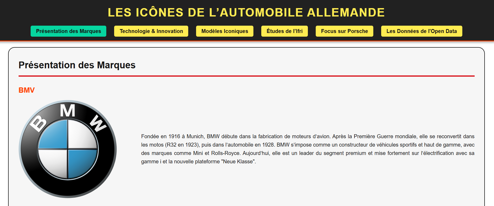

# 🚗 Les Icônes de l’Automobile Allemande

   

## 📖 À propos du projet
Ce projet a été réalisé dans le cadre du cours de "Technologies Web" au **Grenoble IAE**.
L'objectif était de concevoir un site web **mono-page (Single Page Application)** complet, structuré et enrichi par des données réelles, sur le thème de l'industrie automobile allemande.

Il combine présentation historique, analyse technologique et visualisation de données économiques.

## ✨ Fonctionnalités Principales

### 1. Structure Sémantique & Navigation
* **Navigation fluide :** Menu sticky permettant d'accéder rapidement aux sections (ancres HTML).
* **Architecture claire :** Utilisation des balises sémantiques HTML5 (`<header>`, `<main>`, `<section>`, `<footer>`).

### 2. Contenu Riche & Multimédia
* **Présentation des marques :** Fiches détaillées pour BMW, Mercedes-Benz, Audi, Porsche et Volkswagen.
* **Focus Porsche :** Intégration d'une vidéo YouTube (`<iframe>`) retraçant l'histoire de la marque.
* **Documentation externe :** Intégration directe d'une étude PDF de l'**Ifri** sur l'avenir de l'automobile allemande.
* **Tableaux comparatifs :** Mise en forme de données techniques sur les modèles iconiques (Golf GTI, 911, M3...).

### 3. Data Visualisation (Open Data)
Intégration de graphiques interactifs générés via **Flourish**, basés sur des données réelles du marché automobile :
* *L'intégration se fait via des scripts JavaScript pour un rendu dynamique.*

## 🛠️ Compétences Techniques Mises en Œuvre
* **HTML5 :** Structure rigoureuse, gestion des images, listes et tableaux.
* **CSS3 :** Mise en page (Flexbox), design responsive (adapté aux écrans), gestion des typographies et couleurs.
* **Intégration Multimédia :** Gestion des iFrames (PDF/Youtube) et scripts tiers (Flourish).
* **Travail d'équipe :** Collaboration et répartition des tâches techniques et rédactionnelles.

## 👥 L'Équipe (Grenoble IAE)
Projet réalisé par :
* **Abdoullah BOUZIAN**
* **Haroun LAHSSINI**
* **Mehdi ROUGUI**
* **Konrad SKOCZEN**
